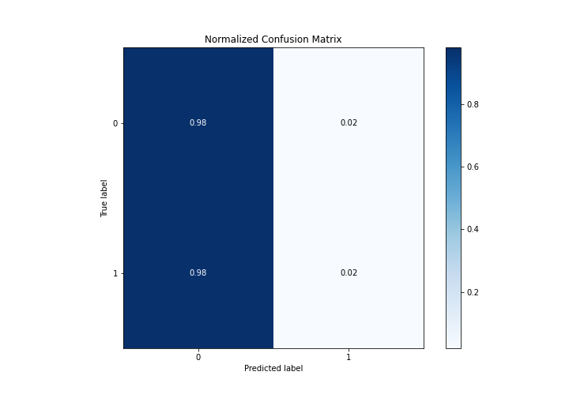

# Summary of 11_RandomForest_RandomFeature

[<< Go back](../README.md)

## Random Forest
- **n_jobs**: -1
- **criterion**: gini
- **max_features**: 0.7
- **min_samples_split**: 30
- **max_depth**: 7
- **eval_metric_name**: logloss
- **explain_level**: 1

## Validation
 - **validation_type**: split
 - **train_ratio**: 0.75
 - **shuffle**: True
 - **stratify**: True

## Optimized metric
logloss

## Training time

54.3 seconds

## Metric details
|           |     score |   threshold |
|:----------|----------:|------------:|
| logloss   | 0.307976  | nan         |
| auc       | 0.530053  | nan         |
| f1        | 0.172513  |   0.0848991 |
| accuracy  | 0.889126  |   0.118715  |
| precision | 0.105851  |   0.104216  |
| recall    | 1         |   0.0568131 |
| mcc       | 0.0290592 |   0.0907397 |

## Metric details with threshold from accuracy metric
|           |       score |   threshold |
|:----------|------------:|------------:|
| logloss   | 0.307976    |  nan        |
| auc       | 0.530053    |  nan        |
| f1        | 0.0370752   |    0.118715 |
| accuracy  | 0.889126    |    0.118715 |
| precision | 0.0942408   |    0.118715 |
| recall    | 0.0230769   |    0.118715 |
| mcc       | 0.000917969 |    0.118715 |

## Confusion matrix (at threshold=0.118715)
|              |   Predicted as 0 |   Predicted as 1 |
|:-------------|-----------------:|-----------------:|
| Labeled as 0 |            14960 |              346 |
| Labeled as 1 |             1524 |               36 |

## Learning curves

## Permutation-based Importance

## Confusion Matrix

## Normalized Confusion Matrix

## ROC Curve

## Kolmogorov-Smirnov Statistic

## Precision-Recall Curve

## Calibration Curve

## Cumulative Gains Curve

## Lift Curve

[<< Go back](../README.md)
