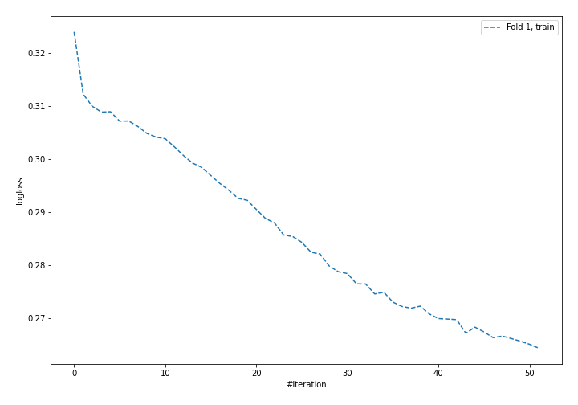
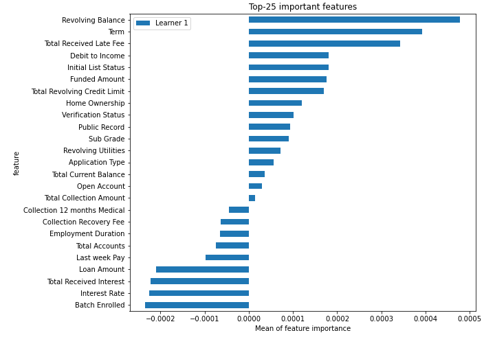
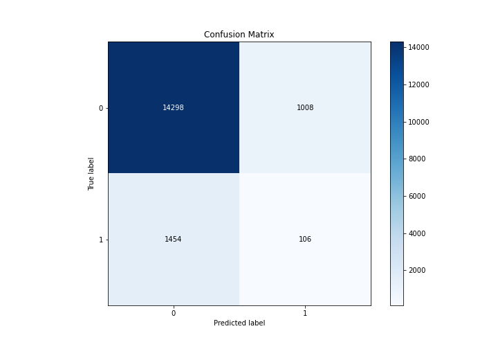
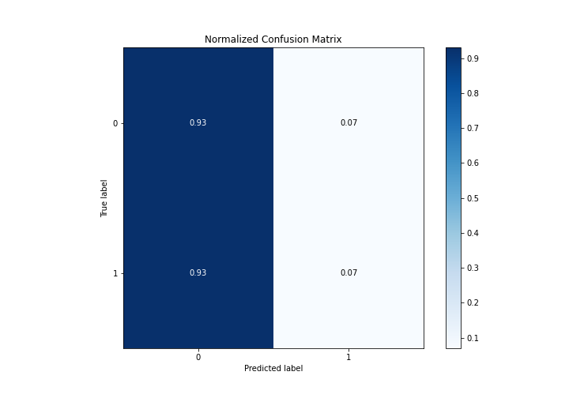
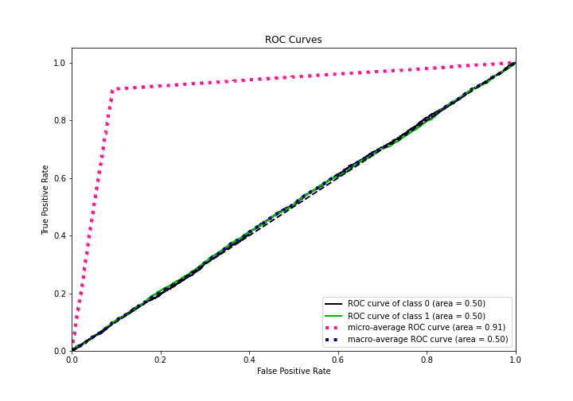
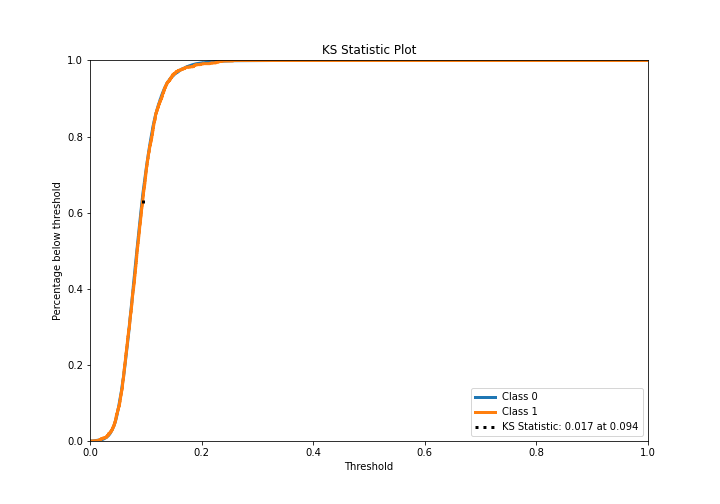
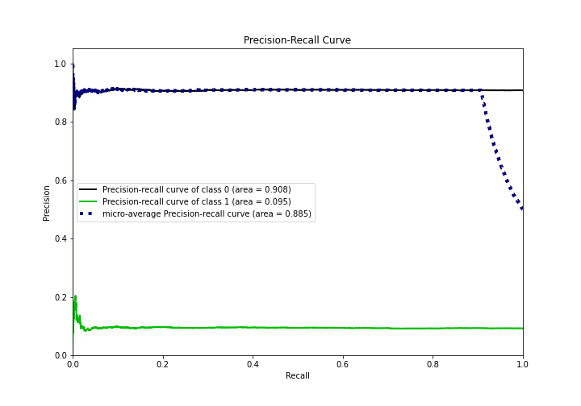
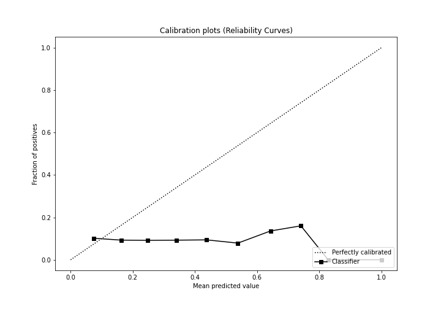
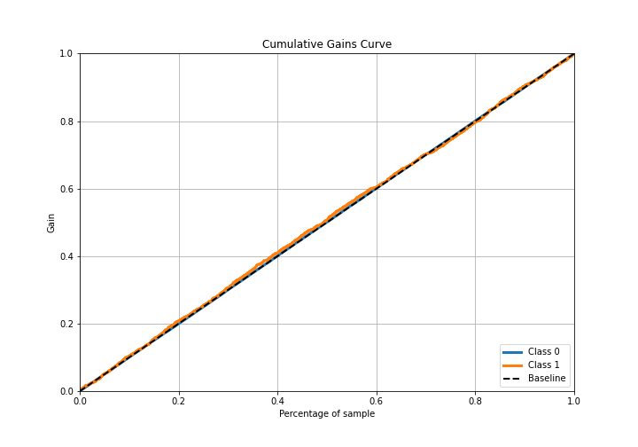
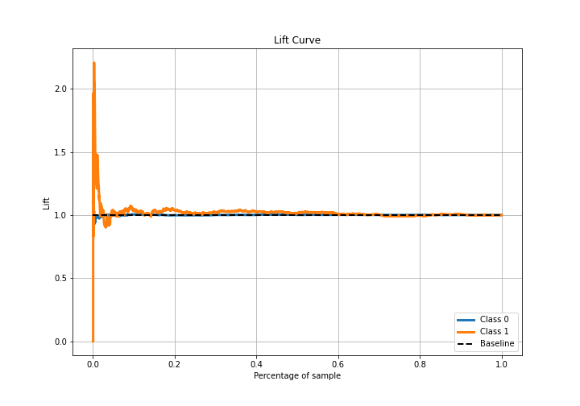

# Summary of 13_NeuralNetwork

[<< Go back](../README.md)

## Neural Network
- **n_jobs**: -1
- **dense_1_size**: 64
- **dense_2_size**: 16
- **learning_rate**: 0.01
- **explain_level**: 2

## Validation
 - **validation_type**: split
 - **train_ratio**: 0.75
 - **shuffle**: True
 - **stratify**: True

## Optimized metric
logloss

## Training time

40.1 seconds

## Metric details
|           |      score |    threshold |
|:----------|-----------:|-------------:|
| logloss   | 0.314488   | nan          |
| auc       | 0.504556   | nan          |
| f1        | 0.169326   |   0.00354768 |
| accuracy  | 0.854026   |   0.135987   |
| precision | 0.0973612  |   0.11037    |
| recall    | 1          |   0.00354768 |
| mcc       | 0.00862531 |   0.0799726  |

## Metric details with threshold from accuracy metric
|           |      score |   threshold |
|:----------|-----------:|------------:|
| logloss   | 0.314488   |  nan        |
| auc       | 0.504556   |  nan        |
| f1        | 0.079282   |    0.135987 |
| accuracy  | 0.854026   |    0.135987 |
| precision | 0.0951526  |    0.135987 |
| recall    | 0.0679487  |    0.135987 |
| mcc       | 0.00244053 |    0.135987 |

## Confusion matrix (at threshold=0.135987)
|              |   Predicted as 0 |   Predicted as 1 |
|:-------------|-----------------:|-----------------:|
| Labeled as 0 |            14298 |             1008 |
| Labeled as 1 |             1454 |              106 |

## Learning curves

## Permutation-based Importance

## Confusion Matrix

## Normalized Confusion Matrix

## ROC Curve

## Kolmogorov-Smirnov Statistic

## Precision-Recall Curve

## Calibration Curve

## Cumulative Gains Curve

## Lift Curve

[<< Go back](../README.md)
