# Summary of 2_DecisionTree

[<< Go back](../README.md)

## Decision Tree
- **n_jobs**: -1
- **criterion**: gini
- **max_depth**: 3
- **explain_level**: 2

## Validation
 - **validation_type**: split
 - **train_ratio**: 0.75
 - **shuffle**: True
 - **stratify**: True

## Optimized metric
logloss

## Training time

15.1 seconds

## Metric details
|           |     score |   threshold |
|:----------|----------:|------------:|
| logloss   | 0.30853   | nan         |
| auc       | 0.518103  | nan         |
| f1        | 0.169326  |   0.0705656 |
| accuracy  | 0.903178  |   0.124646  |
| precision | 0.100928  |   0.101458  |
| recall    | 1         |   0.0705656 |
| mcc       | 0.0220398 |   0.095912  |

## Metric details with threshold from accuracy metric
|           |       score |   threshold |
|:----------|------------:|------------:|
| logloss   |  0.30853    |  nan        |
| auc       |  0.518103   |  nan        |
| f1        |  0.00729483 |    0.124646 |
| accuracy  |  0.903178   |    0.124646 |
| precision |  0.0705882  |    0.124646 |
| recall    |  0.00384615 |    0.124646 |
| mcc       | -0.00538113 |    0.124646 |

## Confusion matrix (at threshold=0.124646)
|              |   Predicted as 0 |   Predicted as 1 |
|:-------------|-----------------:|-----------------:|
| Labeled as 0 |            15227 |               79 |
| Labeled as 1 |             1554 |                6 |

## Learning curves
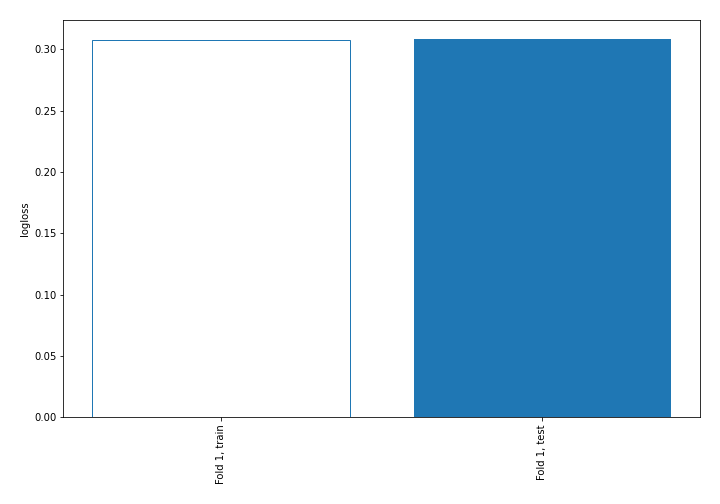

## Decision Tree 

### Tree #1
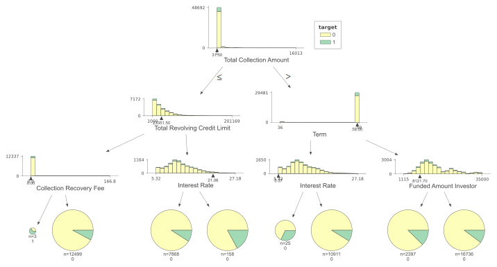

### Rules

if (Total Collection Amount > 31.5) and (Term > 58.5) and (Funded Amount Investor > 8121.695) then class: 0 (proba: 89.85%) | based on 16,736 samples

if (Total Collection Amount <= 31.5) and (Total Revolving Credit Limit <= 23351.5) and (Collection Recovery Fee > 0.0) then class: 0 (proba: 92.16%) | based on 12,499 samples

if (Total Collection Amount > 31.5) and (Term <= 58.5) and (Interest Rate > 5.37) then class: 0 (proba: 91.22%) | based on 10,911 samples

if (Total Collection Amount <= 31.5) and (Total Revolving Credit Limit > 23351.5) and (Interest Rate <= 21.058) then class: 0 (proba: 90.96%) | based on 7,868 samples

if (Total Collection Amount > 31.5) and (Term > 58.5) and (Funded Amount Investor <= 8121.695) then class: 0 (proba: 87.61%) | based on 2,397 samples

if (Total Collection Amount <= 31.5) and (Total Revolving Credit Limit > 23351.5) and (Interest Rate > 21.058) then class: 0 (proba: 82.91%) | based on 158 samples

if (Total Collection Amount > 31.5) and (Term <= 58.5) and (Interest Rate <= 5.37) then class: 0 (proba: 68.0%) | based on 25 samples

if (Total Collection Amount <= 31.5) and (Total Revolving Credit Limit <= 23351.5) and (Collection Recovery Fee <= 0.0) then class: 1 (proba: 66.67%) | based on 3 samples

## Permutation-based Importance
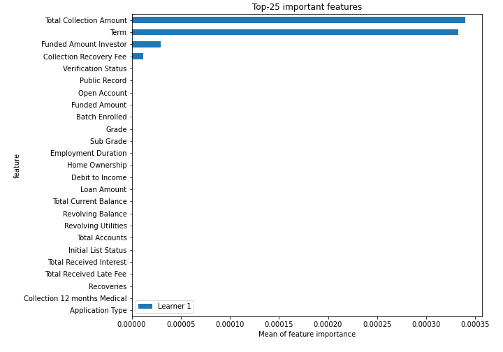
## Confusion Matrix

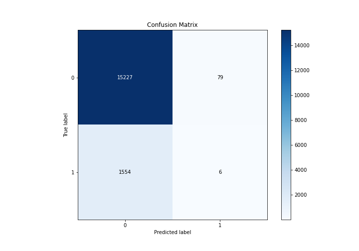

## Normalized Confusion Matrix

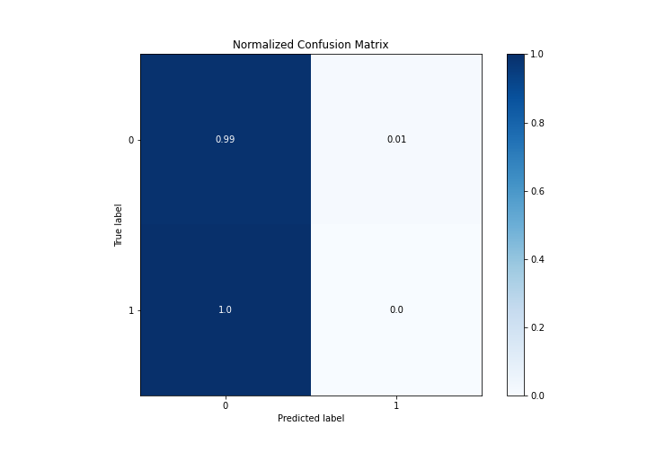

## ROC Curve

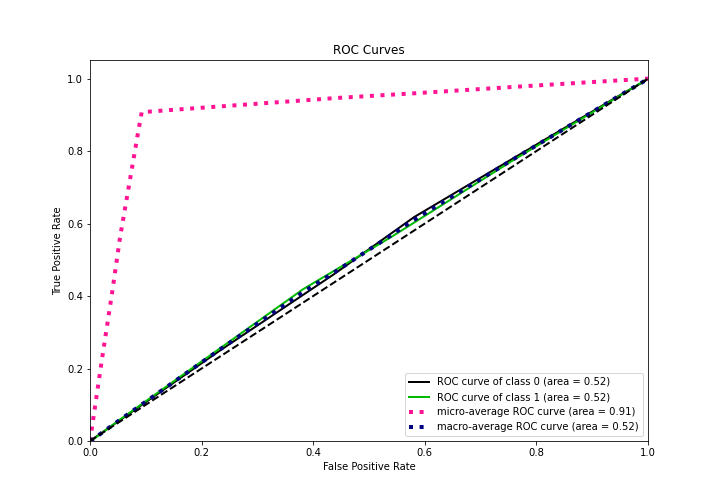

## Kolmogorov-Smirnov Statistic

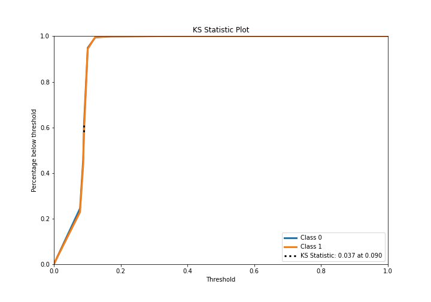

## Precision-Recall Curve

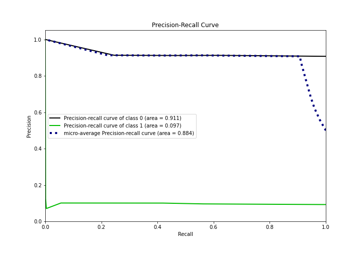

## Calibration Curve

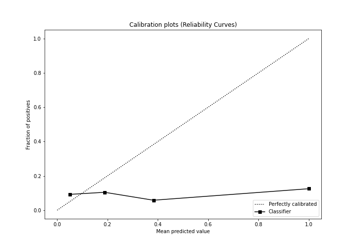

## Cumulative Gains Curve

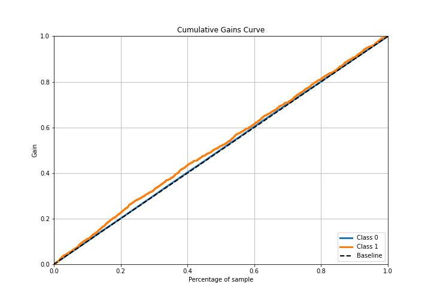

## Lift Curve

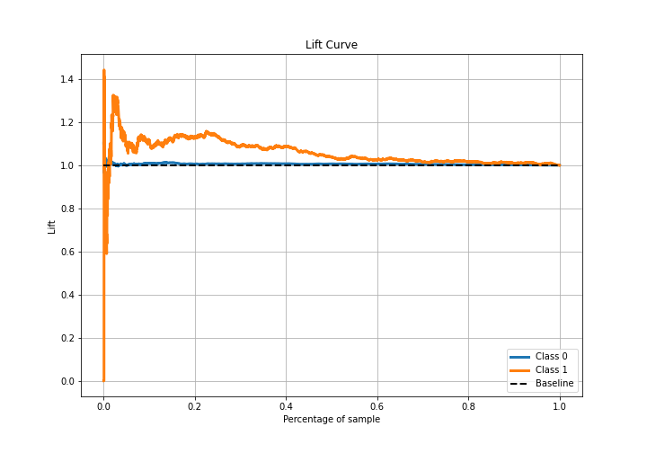

## SHAP Importance
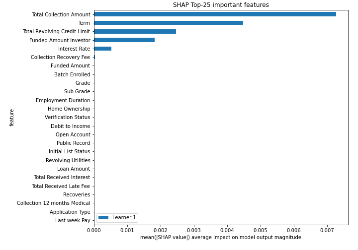

## SHAP Dependence plots

### Dependence (Fold 1)
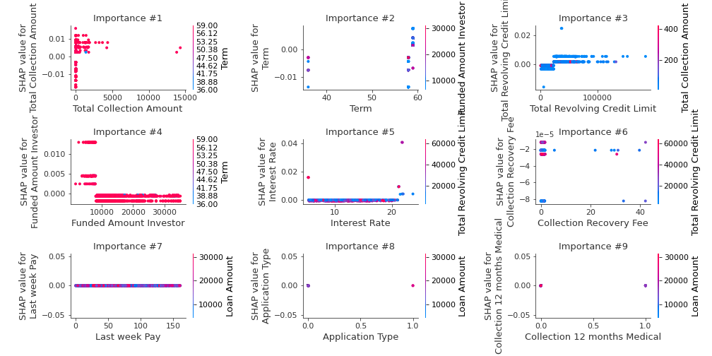

## SHAP Decision plots

### Top-10 Worst decisions for class 0 (Fold 1)
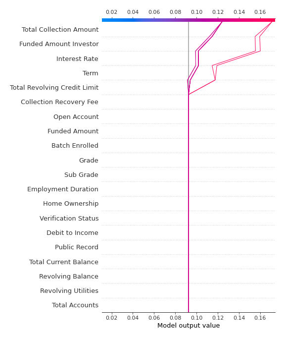
### Top-10 Best decisions for class 0 (Fold 1)
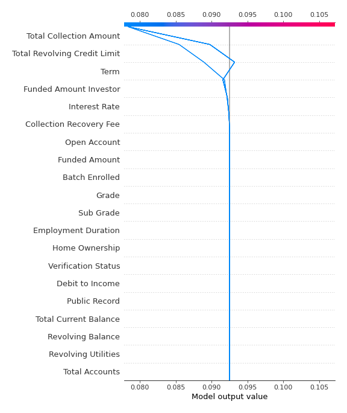
### Top-10 Worst decisions for class 1 (Fold 1)
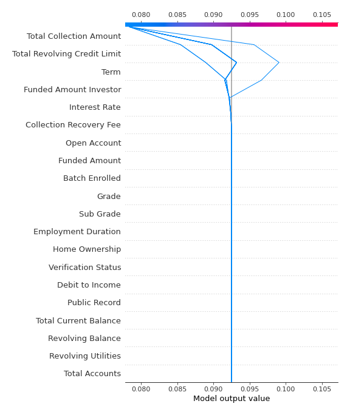
### Top-10 Best decisions for class 1 (Fold 1)
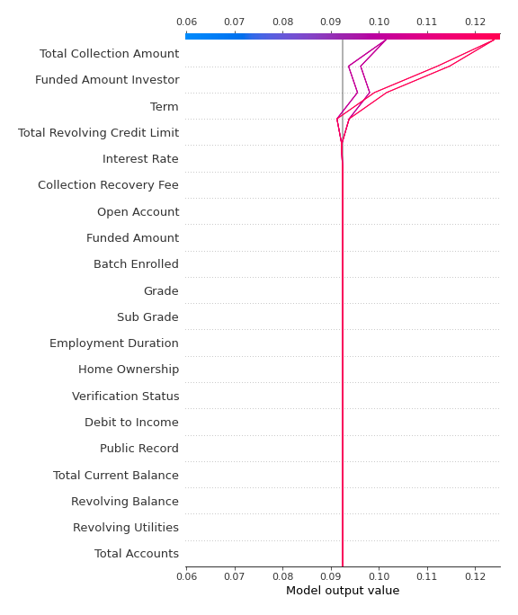

[<< Go back](../README.md)
