# Summary of 3_DecisionTree

[<< Go back](../README.md)

## Decision Tree
- **n_jobs**: -1
- **criterion**: gini
- **max_depth**: 4
- **explain_level**: 2

## Validation
 - **validation_type**: split
 - **train_ratio**: 0.75
 - **shuffle**: True
 - **stratify**: True

## Optimized metric
logloss

## Training time

17.5 seconds

## Metric details
|           |     score |   threshold |
|:----------|----------:|------------:|
| logloss   | 0.314254  | nan         |
| auc       | 0.514439  | nan         |
| f1        | 0.169326  |   0.0681842 |
| accuracy  | 0.90715   |   0.53788   |
| precision | 0.2       |   0.53788   |
| recall    | 1         |   0.0681842 |
| mcc       | 0.0191653 |   0.0954291 |

## Metric details with threshold from accuracy metric
|           |      score |   threshold |
|:----------|-----------:|------------:|
| logloss   | 0.314254   |   nan       |
| auc       | 0.514439   |   nan       |
| f1        | 0.00254777 |     0.53788 |
| accuracy  | 0.90715    |     0.53788 |
| precision | 0.2        |     0.53788 |
| recall    | 0.00128205 |     0.53788 |
| mcc       | 0.00903806 |     0.53788 |

## Confusion matrix (at threshold=0.53788)
|              |   Predicted as 0 |   Predicted as 1 |
|:-------------|-----------------:|-----------------:|
| Labeled as 0 |            15298 |                8 |
| Labeled as 1 |             1558 |                2 |

## Learning curves
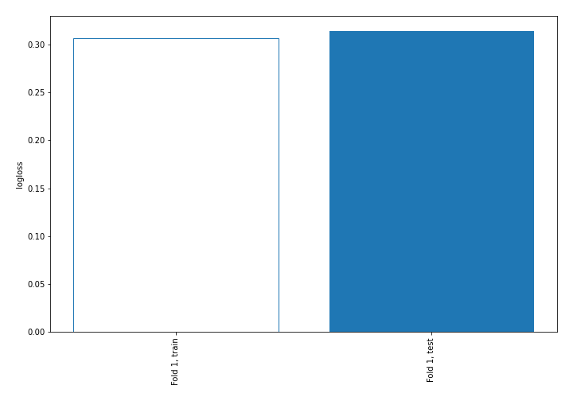

## Decision Tree 

### Tree #1
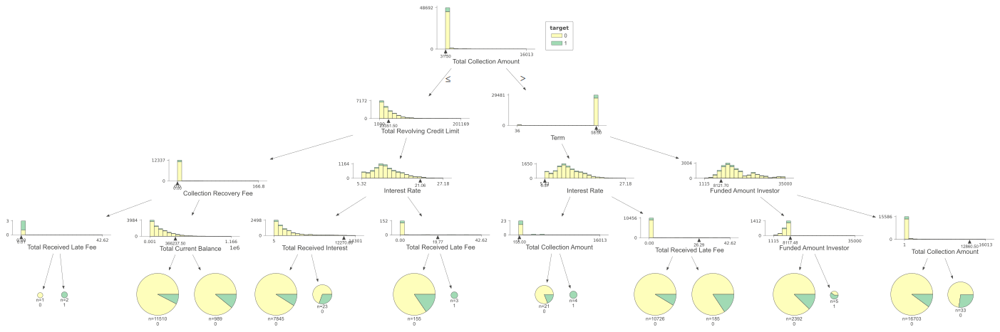

### Rules

if (Total Collection Amount > 31.5) and (Term > 58.5) and (Funded Amount Investor > 8121.695) and (Total Collection Amount <= 12860.5) then class: 0 (proba: 89.89%) | based on 16,703 samples

if (Total Collection Amount <= 31.5) and (Total Revolving Credit Limit <= 23351.5) and (Collection Recovery Fee > 0.0) and (Total Current Balance <= 366237.5) then class: 0 (proba: 92.42%) | based on 11,510 samples

if (Total Collection Amount > 31.5) and (Term <= 58.5) and (Interest Rate > 5.37) and (Total Received Late Fee <= 26.289) then class: 0 (proba: 91.34%) | based on 10,726 samples

if (Total Collection Amount <= 31.5) and (Total Revolving Credit Limit > 23351.5) and (Interest Rate <= 21.058) and (Total Received Interest <= 12270.688) then class: 0 (proba: 91.03%) | based on 7,845 samples

if (Total Collection Amount > 31.5) and (Term > 58.5) and (Funded Amount Investor <= 8121.695) and (Funded Amount Investor <= 8117.483) then class: 0 (proba: 87.71%) | based on 2,392 samples

if (Total Collection Amount <= 31.5) and (Total Revolving Credit Limit <= 23351.5) and (Collection Recovery Fee > 0.0) and (Total Current Balance > 366237.5) then class: 0 (proba: 89.08%) | based on 989 samples

if (Total Collection Amount > 31.5) and (Term <= 58.5) and (Interest Rate > 5.37) and (Total Received Late Fee > 26.289) then class: 0 (proba: 84.32%) | based on 185 samples

if (Total Collection Amount <= 31.5) and (Total Revolving Credit Limit > 23351.5) and (Interest Rate > 21.058) and (Total Received Late Fee <= 19.775) then class: 0 (proba: 84.52%) | based on 155 samples

if (Total Collection Amount > 31.5) and (Term > 58.5) and (Funded Amount Investor > 8121.695) and (Total Collection Amount > 12860.5) then class: 0 (proba: 72.73%) | based on 33 samples

if (Total Collection Amount <= 31.5) and (Total Revolving Credit Limit > 23351.5) and (Interest Rate <= 21.058) and (Total Received Interest > 12270.688) then class: 0 (proba: 69.57%) | based on 23 samples

if (Total Collection Amount > 31.5) and (Term <= 58.5) and (Interest Rate <= 5.37) and (Total Collection Amount <= 155.0) then class: 0 (proba: 80.95%) | based on 21 samples

if (Total Collection Amount > 31.5) and (Term > 58.5) and (Funded Amount Investor <= 8121.695) and (Funded Amount Investor > 8117.483) then class: 1 (proba: 60.0%) | based on 5 samples

if (Total Collection Amount > 31.5) and (Term <= 58.5) and (Interest Rate <= 5.37) and (Total Collection Amount > 155.0) then class: 1 (proba: 100.0%) | based on 4 samples

if (Total Collection Amount <= 31.5) and (Total Revolving Credit Limit > 23351.5) and (Interest Rate > 21.058) and (Total Received Late Fee > 19.775) then class: 1 (proba: 100.0%) | based on 3 samples

if (Total Collection Amount <= 31.5) and (Total Revolving Credit Limit <= 23351.5) and (Collection Recovery Fee <= 0.0) and (Total Received Late Fee > 0.01) then class: 1 (proba: 100.0%) | based on 2 samples

if (Total Collection Amount <= 31.5) and (Total Revolving Credit Limit <= 23351.5) and (Collection Recovery Fee <= 0.0) and (Total Received Late Fee <= 0.01) then class: 0 (proba: 100.0%) | based on 1 samples

## Permutation-based Importance
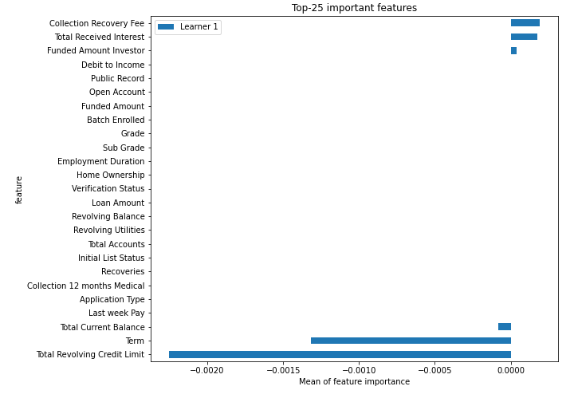
## Confusion Matrix

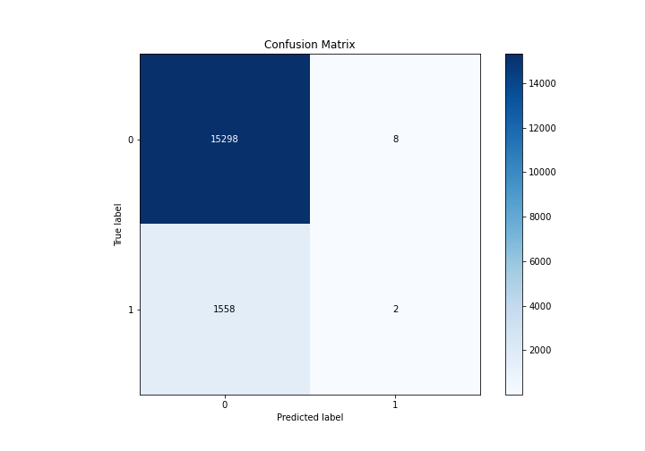

## Normalized Confusion Matrix

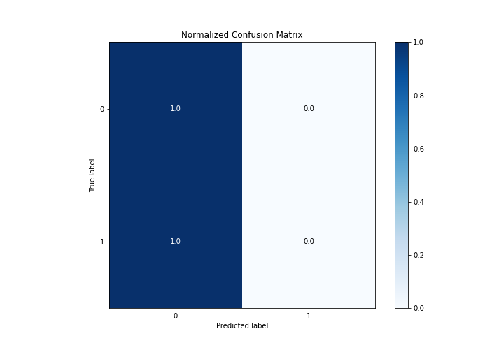

## ROC Curve

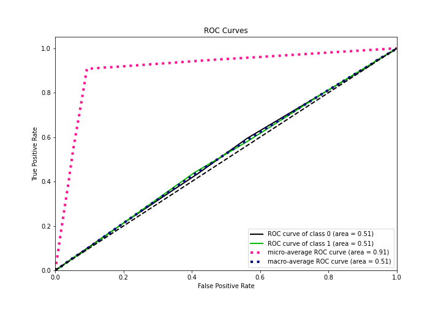

## Kolmogorov-Smirnov Statistic

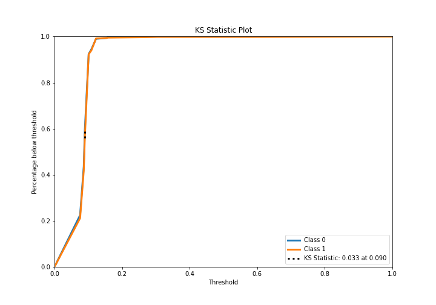

## Precision-Recall Curve

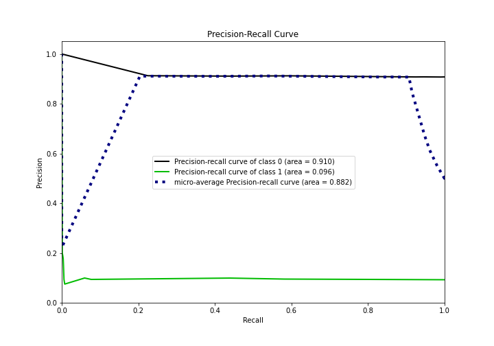

## Calibration Curve

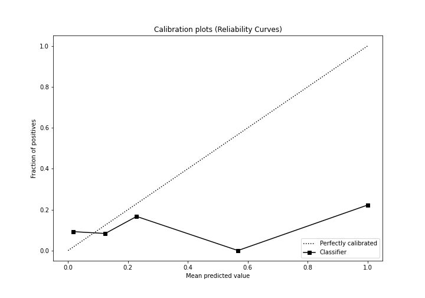

## Cumulative Gains Curve

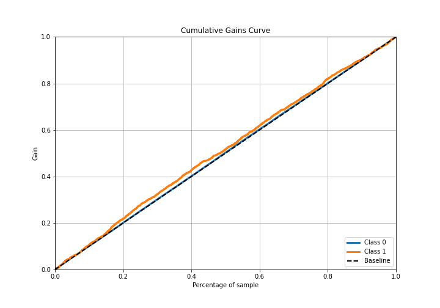

## Lift Curve

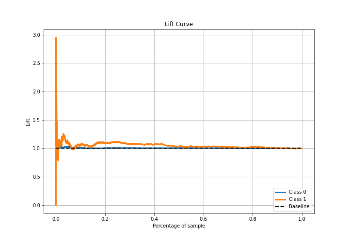

## SHAP Importance
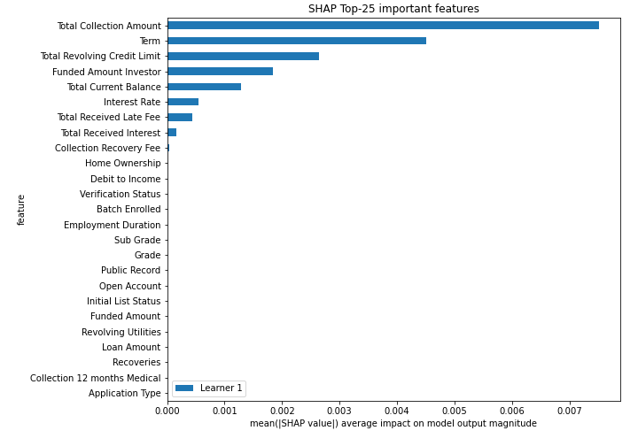

## SHAP Dependence plots

### Dependence (Fold 1)
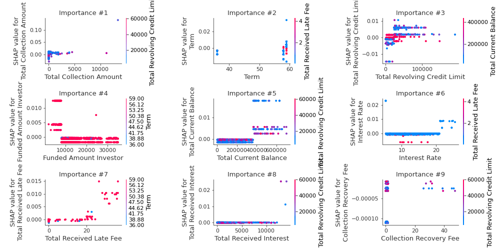

## SHAP Decision plots

### Top-10 Worst decisions for class 0 (Fold 1)
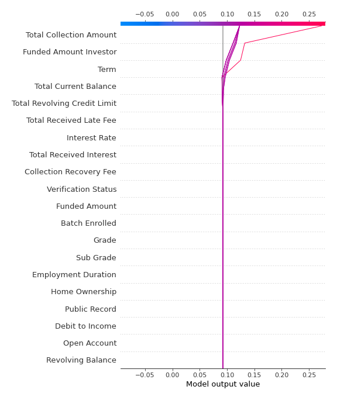
### Top-10 Best decisions for class 0 (Fold 1)

### Top-10 Worst decisions for class 1 (Fold 1)
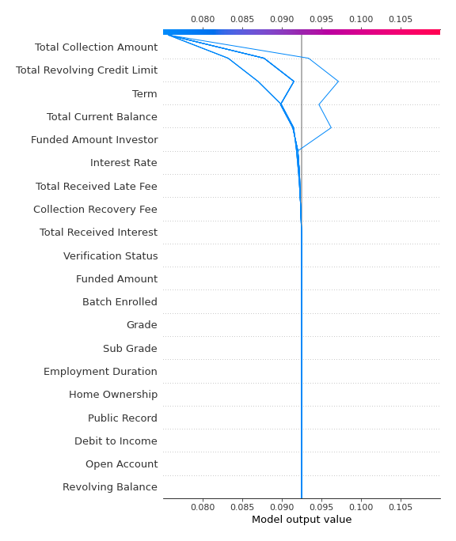
### Top-10 Best decisions for class 1 (Fold 1)
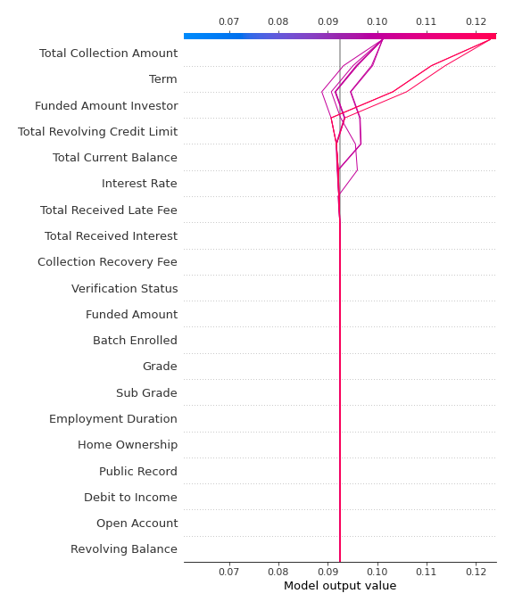

[<< Go back](../README.md)
