# Summary of 5_Default_Xgboost_SelectedFeatures

[<< Go back](../README.md)

## Extreme Gradient Boosting (Xgboost)
- **n_jobs**: -1
- **objective**: binary:logistic
- **eta**: 0.075
- **max_depth**: 6
- **min_child_weight**: 1
- **subsample**: 1.0
- **colsample_bytree**: 1.0
- **eval_metric**: logloss
- **explain_level**: 2

## Validation
 - **validation_type**: split
 - **train_ratio**: 0.75
 - **shuffle**: True
 - **stratify**: True

## Optimized metric
logloss

## Training time

17.8 seconds

## Metric details
|           |     score |   threshold |
|:----------|----------:|------------:|
| logloss   | 0.309074  | nan         |
| auc       | 0.521487  | nan         |
| f1        | 0.170966  |   0.0946754 |
| accuracy  | 0.892506  |   0.141133  |
| precision | 0.116041  |   0.131392  |
| recall    | 1         |   0.0355502 |
| mcc       | 0.0310402 |   0.0946754 |

## Metric details with threshold from accuracy metric
|           |      score |   threshold |
|:----------|-----------:|------------:|
| logloss   | 0.309074   |  nan        |
| auc       | 0.521487   |  nan        |
| f1        | 0.0351251  |    0.141133 |
| accuracy  | 0.892506   |    0.141133 |
| precision | 0.103448   |    0.141133 |
| recall    | 0.0211538  |    0.141133 |
| mcc       | 0.00524985 |    0.141133 |

## Confusion matrix (at threshold=0.141133)
|              |   Predicted as 0 |   Predicted as 1 |
|:-------------|-----------------:|-----------------:|
| Labeled as 0 |            15020 |              286 |
| Labeled as 1 |             1527 |               33 |

## Learning curves
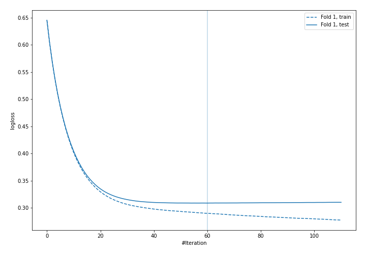

## Permutation-based Importance
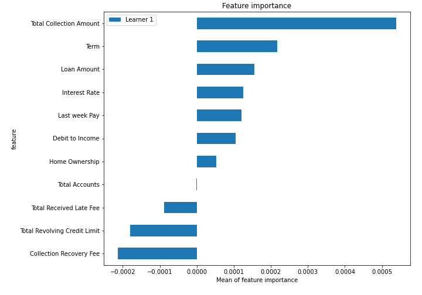
## Confusion Matrix

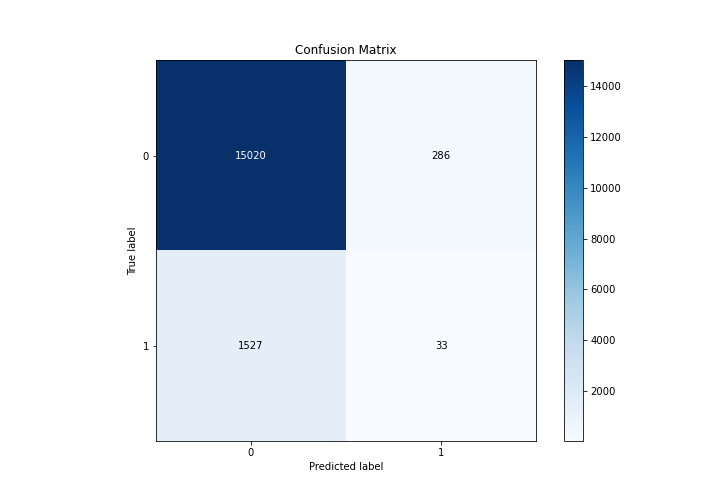

## Normalized Confusion Matrix

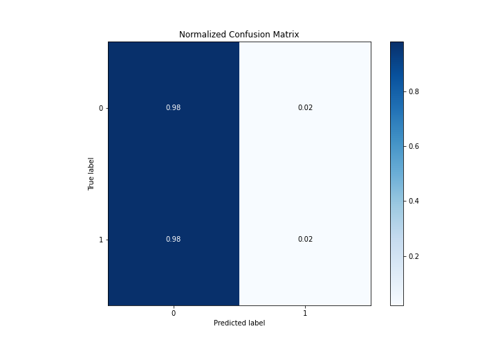

## ROC Curve

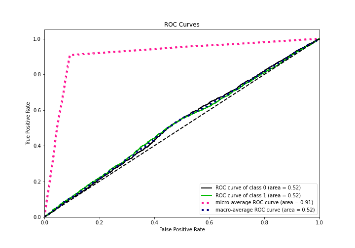

## Kolmogorov-Smirnov Statistic

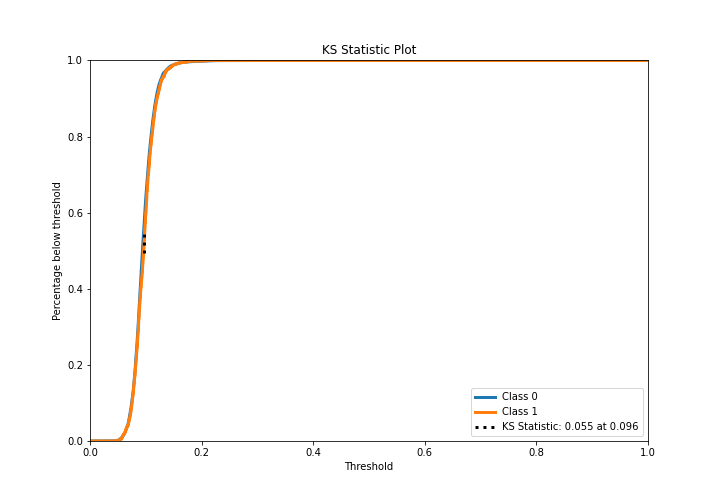

## Precision-Recall Curve

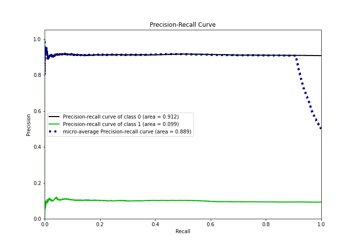

## Calibration Curve

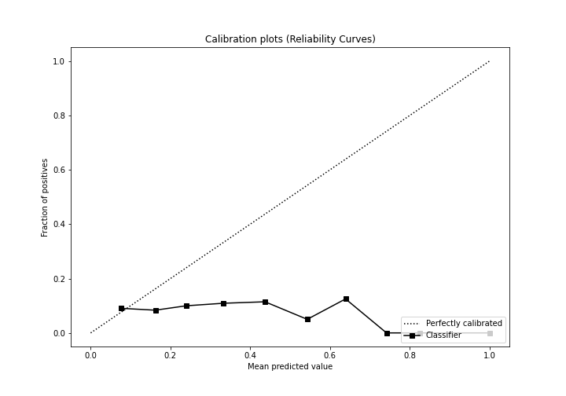

## Cumulative Gains Curve

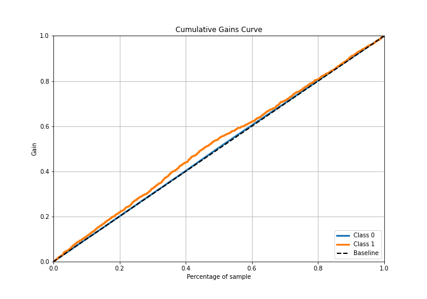

## Lift Curve

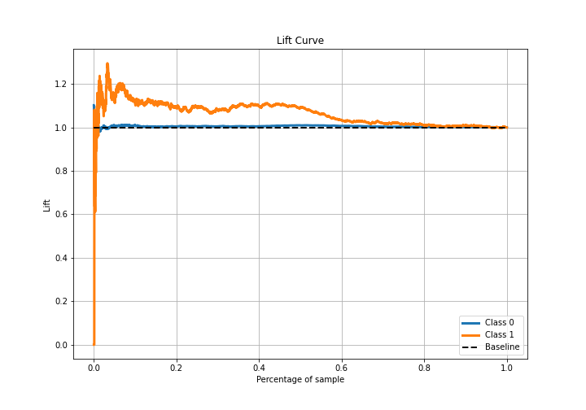

## SHAP Importance
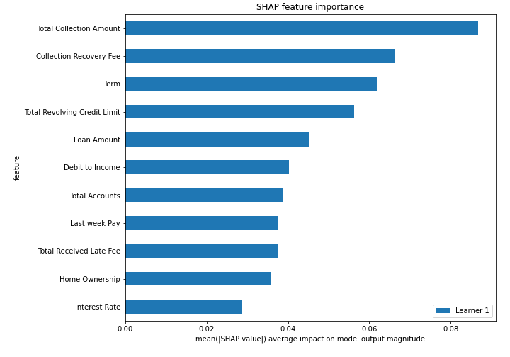

## SHAP Dependence plots

### Dependence (Fold 1)
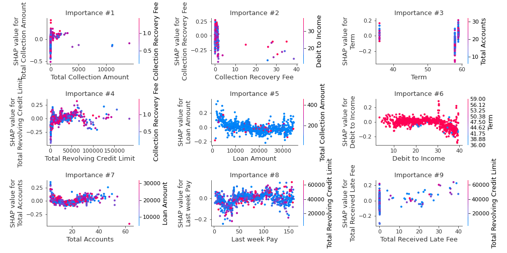

## SHAP Decision plots

### Top-10 Worst decisions for class 0 (Fold 1)
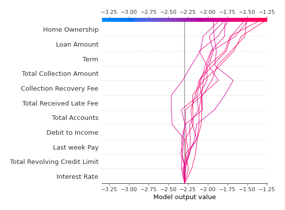
### Top-10 Best decisions for class 0 (Fold 1)
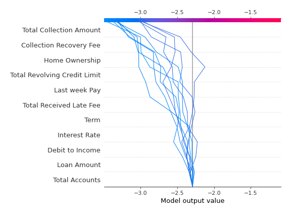
### Top-10 Worst decisions for class 1 (Fold 1)
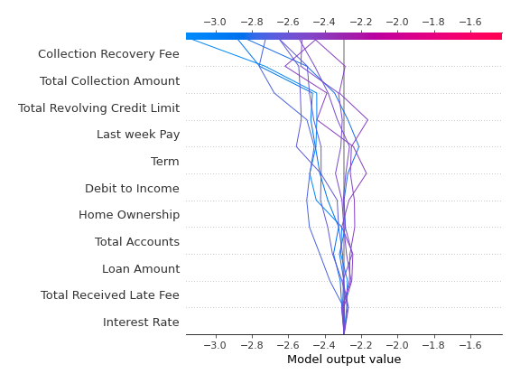
### Top-10 Best decisions for class 1 (Fold 1)
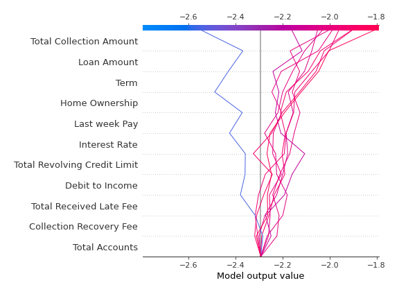

[<< Go back](../README.md)
