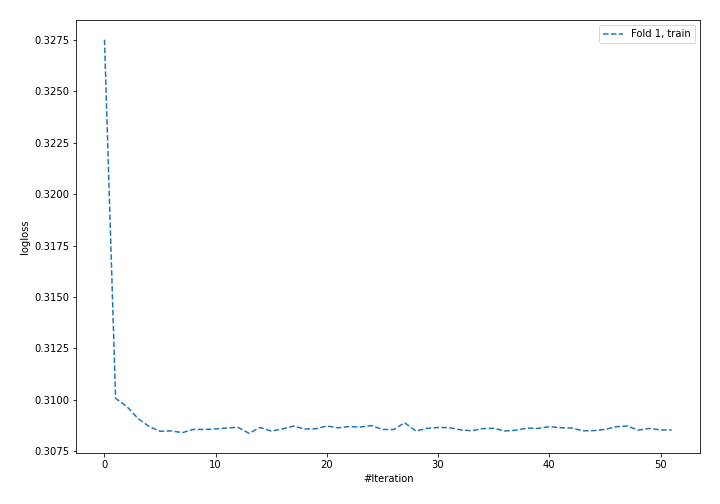
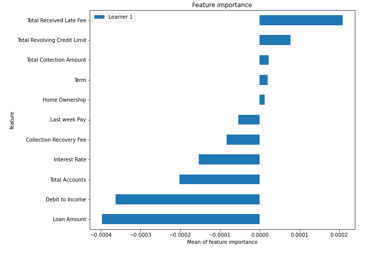
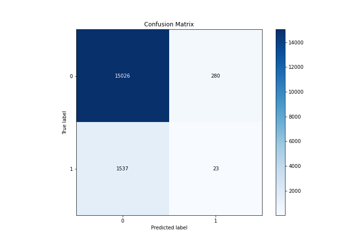
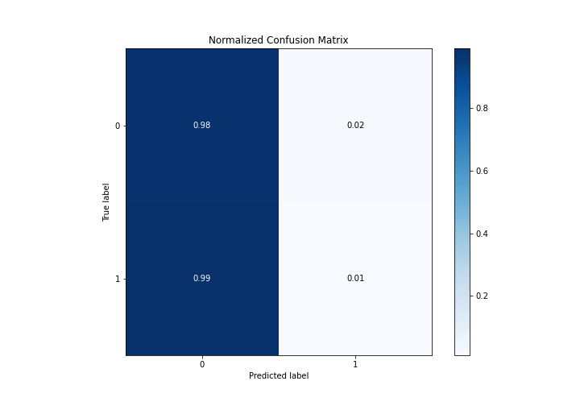
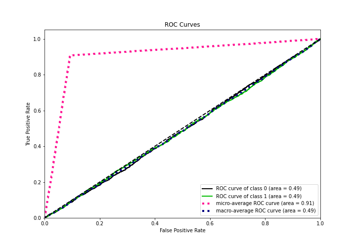
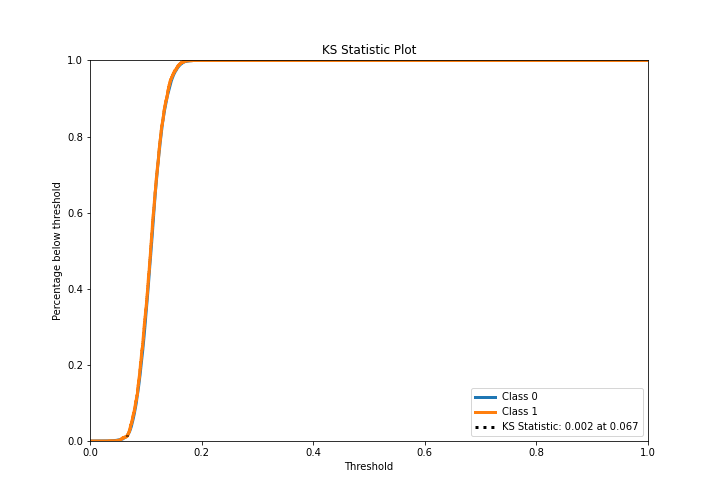
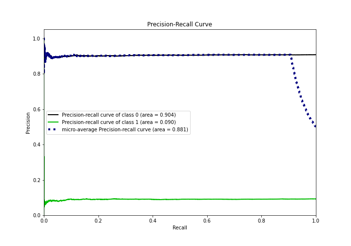
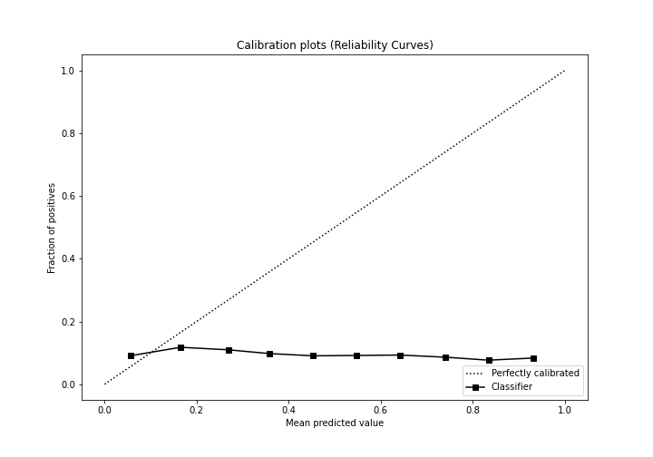
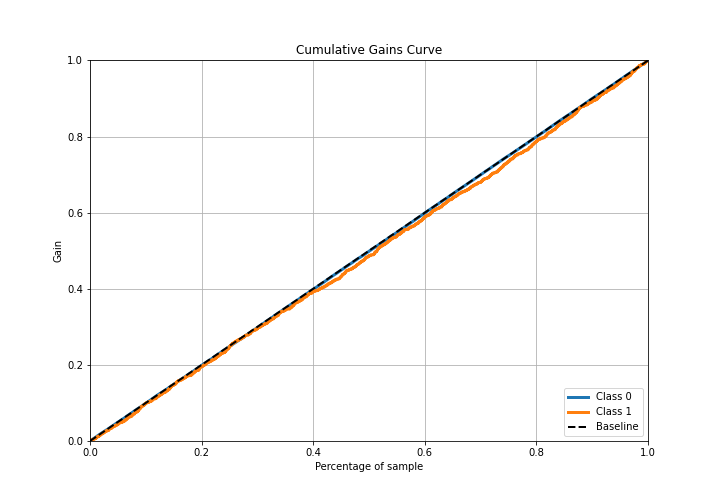
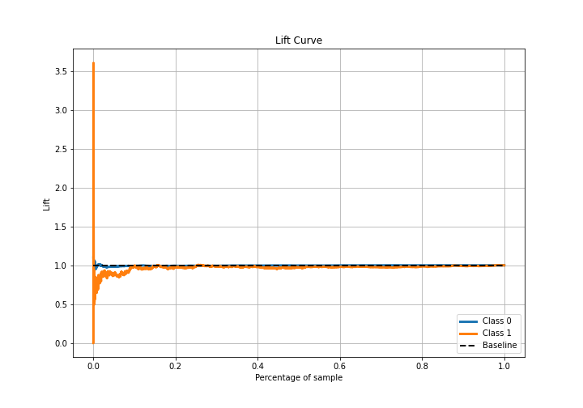

# Summary of 6_Default_NeuralNetwork_SelectedFeatures

[<< Go back](../README.md)

## Neural Network
- **n_jobs**: -1
- **dense_1_size**: 32
- **dense_2_size**: 16
- **learning_rate**: 0.05
- **explain_level**: 2

## Validation
 - **validation_type**: split
 - **train_ratio**: 0.75
 - **shuffle**: True
 - **stratify**: True

## Optimized metric
logloss

## Training time

31.3 seconds

## Metric details
|           |     score |   threshold |
|:----------|----------:|------------:|
| logloss   | 0.312654  | nan         |
| auc       | 0.489812  | nan         |
| f1        | 0.169326  |   0.0203821 |
| accuracy  | 0.892268  |   0.157336  |
| precision | 0.0924938 |   0.0203821 |
| recall    | 1         |   0.0203821 |
| mcc       | 0         |   0.0203821 |

## Metric details with threshold from accuracy metric
|           |       score |   threshold |
|:----------|------------:|------------:|
| logloss   |  0.312654   |  nan        |
| auc       |  0.489812   |  nan        |
| f1        |  0.0246914  |    0.157336 |
| accuracy  |  0.892268   |    0.157336 |
| precision |  0.0759076  |    0.157336 |
| recall    |  0.0147436  |    0.157336 |
| mcc       | -0.00774314 |    0.157336 |

## Confusion matrix (at threshold=0.157336)
|              |   Predicted as 0 |   Predicted as 1 |
|:-------------|-----------------:|-----------------:|
| Labeled as 0 |            15026 |              280 |
| Labeled as 1 |             1537 |               23 |

## Learning curves

## Permutation-based Importance

## Confusion Matrix

## Normalized Confusion Matrix

## ROC Curve

## Kolmogorov-Smirnov Statistic

## Precision-Recall Curve

## Calibration Curve

## Cumulative Gains Curve

## Lift Curve

[<< Go back](../README.md)
