# Summary of 9_Xgboost

[<< Go back](../README.md)

## Extreme Gradient Boosting (Xgboost)
- **n_jobs**: -1
- **objective**: binary:logistic
- **eta**: 0.1
- **max_depth**: 8
- **min_child_weight**: 1
- **subsample**: 1.0
- **colsample_bytree**: 1.0
- **eval_metric**: logloss
- **explain_level**: 2

## Validation
 - **validation_type**: split
 - **train_ratio**: 0.75
 - **shuffle**: True
 - **stratify**: True

## Optimized metric
logloss

## Training time

25.1 seconds

## Metric details
|           |     score |   threshold |
|:----------|----------:|------------:|
| logloss   | 0.309572  | nan         |
| auc       | 0.530247  | nan         |
| f1        | 0.173599  |   0.0937913 |
| accuracy  | 0.889007  |   0.158299  |
| precision | 0.106114  |   0.130789  |
| recall    | 1         |   0.0276355 |
| mcc       | 0.0365993 |   0.0986812 |

## Metric details with threshold from accuracy metric
|           |      score |   threshold |
|:----------|-----------:|------------:|
| logloss   | 0.309572   |  nan        |
| auc       | 0.530247   |  nan        |
| f1        | 0.04       |    0.158299 |
| accuracy  | 0.889007   |    0.158299 |
| precision | 0.1        |    0.158299 |
| recall    | 0.025      |    0.158299 |
| mcc       | 0.00398609 |    0.158299 |

## Confusion matrix (at threshold=0.158299)
|              |   Predicted as 0 |   Predicted as 1 |
|:-------------|-----------------:|-----------------:|
| Labeled as 0 |            14955 |              351 |
| Labeled as 1 |             1521 |               39 |

## Learning curves
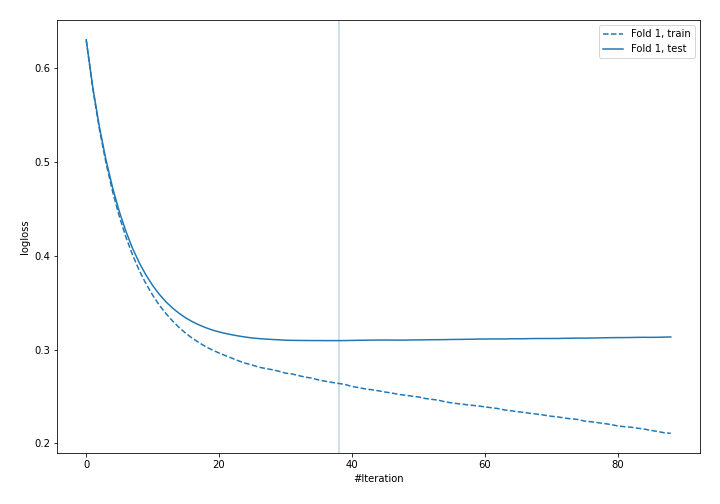

## Permutation-based Importance
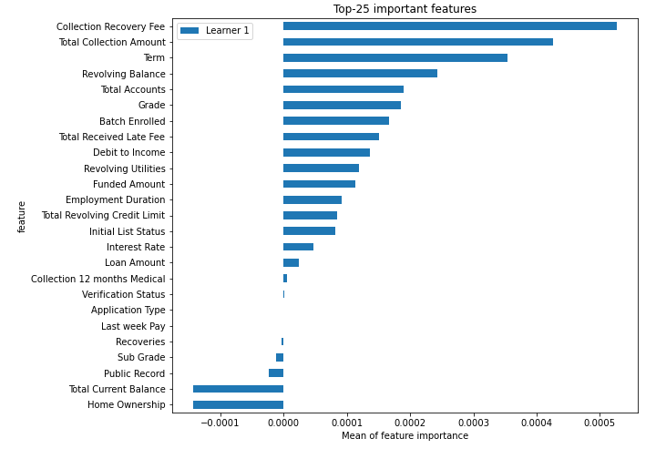
## Confusion Matrix

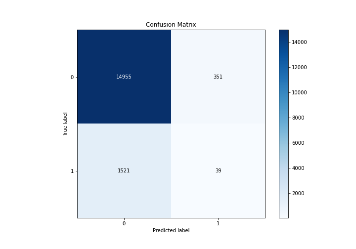

## Normalized Confusion Matrix

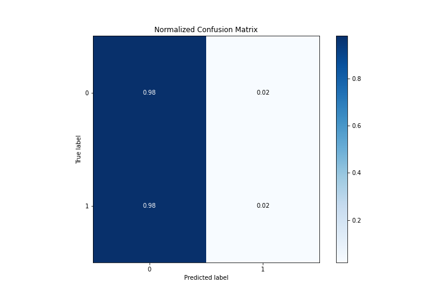

## ROC Curve

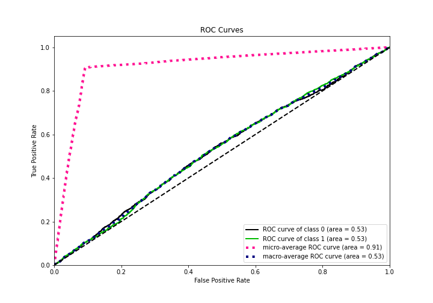

## Kolmogorov-Smirnov Statistic

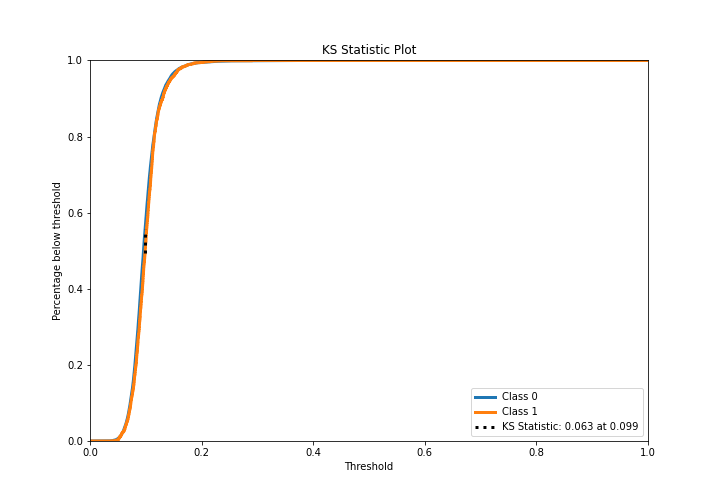

## Precision-Recall Curve

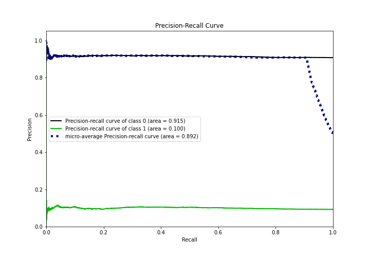

## Calibration Curve

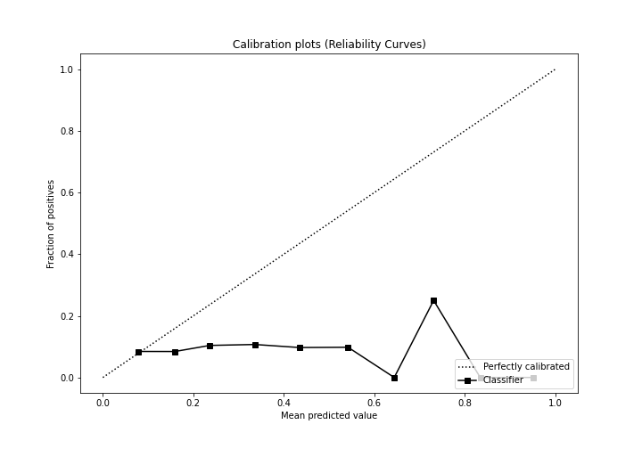

## Cumulative Gains Curve

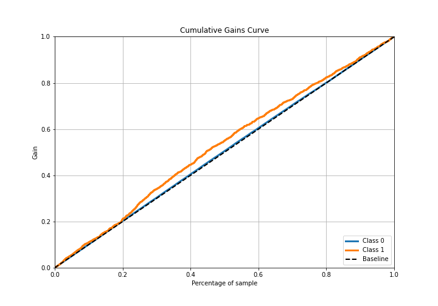

## Lift Curve

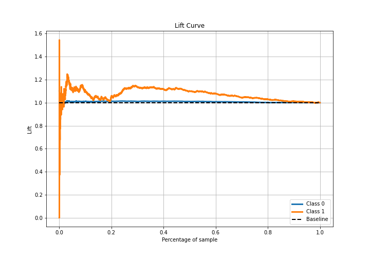

## SHAP Importance
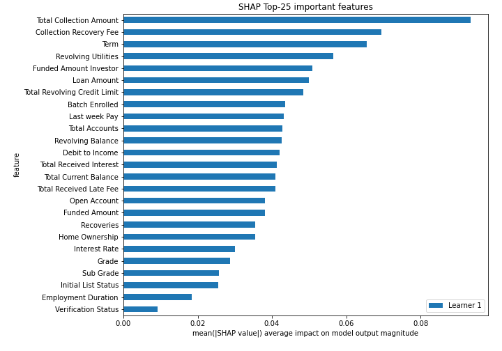

## SHAP Dependence plots

### Dependence (Fold 1)
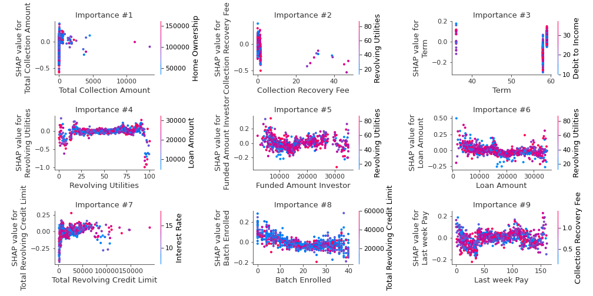

## SHAP Decision plots

### Top-10 Worst decisions for class 0 (Fold 1)
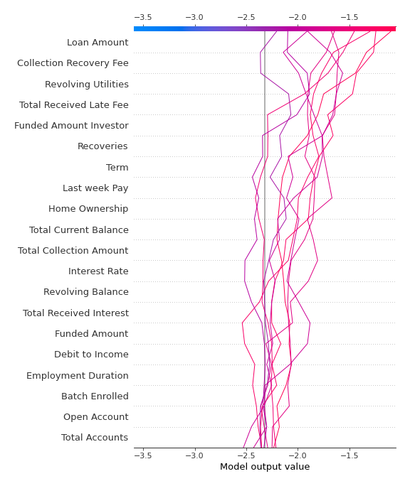
### Top-10 Best decisions for class 0 (Fold 1)
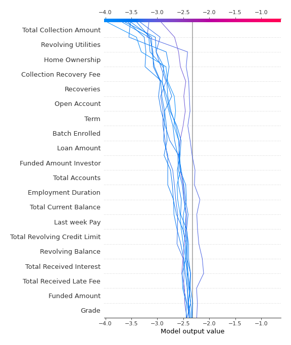
### Top-10 Worst decisions for class 1 (Fold 1)
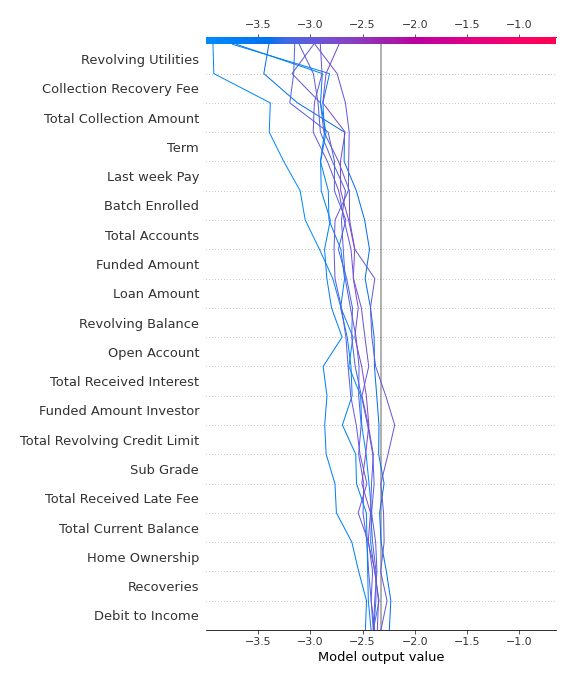
### Top-10 Best decisions for class 1 (Fold 1)
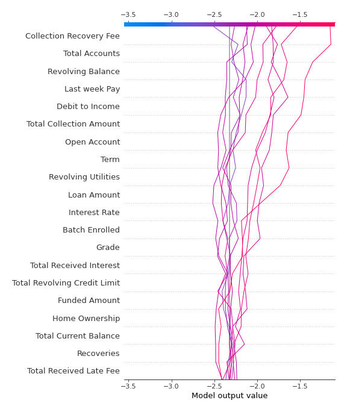

[<< Go back](../README.md)
