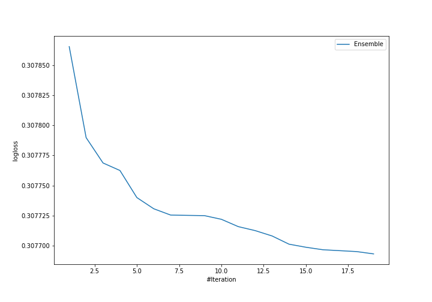
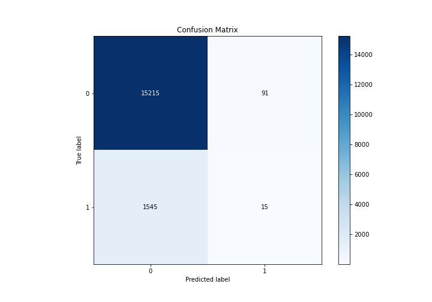
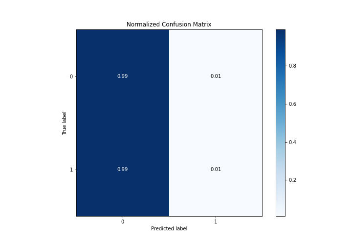
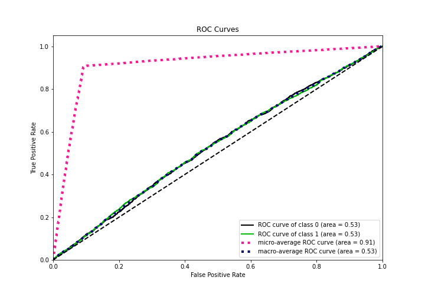
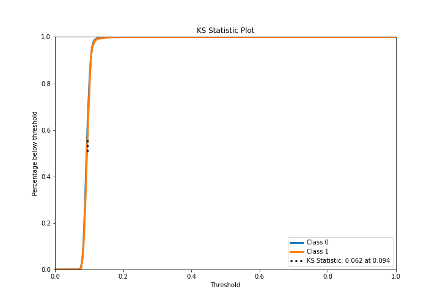
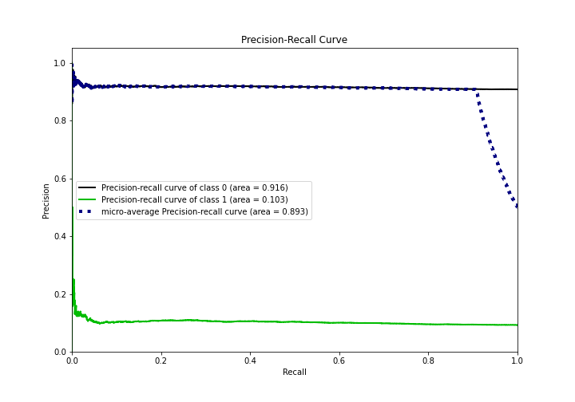
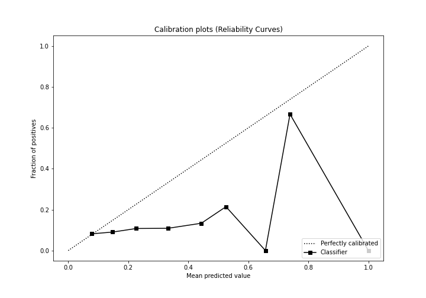
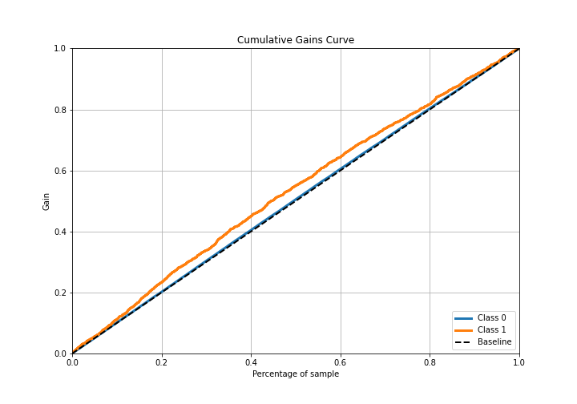
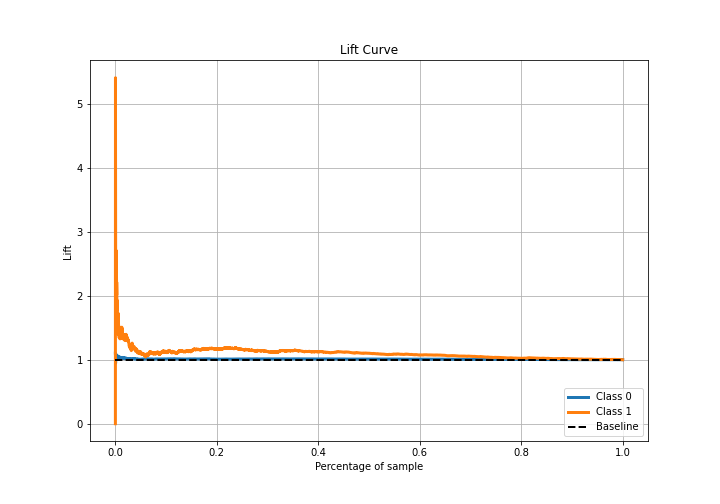

# Summary of Ensemble

[<< Go back](../README.md)

## Ensemble structure
| Model                                 |   Weight |
|:--------------------------------------|---------:|
| 10_RandomForest                       |        1 |
| 11_RandomForest                       |        4 |
| 11_RandomForest_GoldenFeatures        |        1 |
| 11_RandomForest_SelectedFeatures      |        3 |
| 13_NeuralNetwork                      |        1 |
| 3_DecisionTree                        |        1 |
| 6_Default_NeuralNetwork               |        1 |
| 7_Default_RandomForest_GoldenFeatures |        4 |
| 8_Xgboost                             |        1 |
| 9_Xgboost                             |        2 |

## Metric details
|           |     score |   threshold |
|:----------|----------:|------------:|
| logloss   | 0.307693  | nan         |
| auc       | 0.533807  | nan         |
| f1        | 0.173506  |   0.0897609 |
| accuracy  | 0.903     |   0.123295  |
| precision | 0.141509  |   0.123295  |
| recall    | 1         |   0.060899  |
| mcc       | 0.0354346 |   0.0939916 |

## Metric details with threshold from accuracy metric
|           |      score |   threshold |
|:----------|-----------:|------------:|
| logloss   | 0.307693   |  nan        |
| auc       | 0.533807   |  nan        |
| f1        | 0.0180072  |    0.123295 |
| accuracy  | 0.903      |    0.123295 |
| precision | 0.141509   |    0.123295 |
| recall    | 0.00961538 |    0.123295 |
| mcc       | 0.0134546  |    0.123295 |

## Confusion matrix (at threshold=0.123295)
|              |   Predicted as 0 |   Predicted as 1 |
|:-------------|-----------------:|-----------------:|
| Labeled as 0 |            15215 |               91 |
| Labeled as 1 |             1545 |               15 |

## Learning curves

## Confusion Matrix

## Normalized Confusion Matrix

## ROC Curve

## Kolmogorov-Smirnov Statistic

## Precision-Recall Curve

## Calibration Curve

## Cumulative Gains Curve

## Lift Curve

[<< Go back](../README.md)
