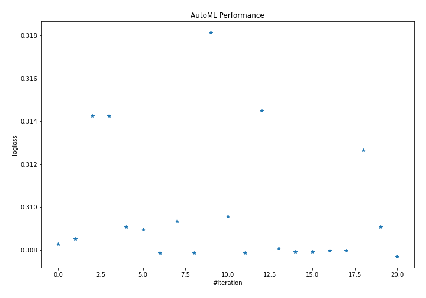
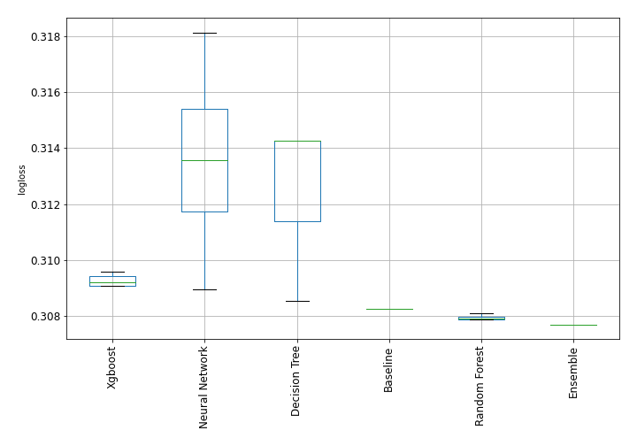
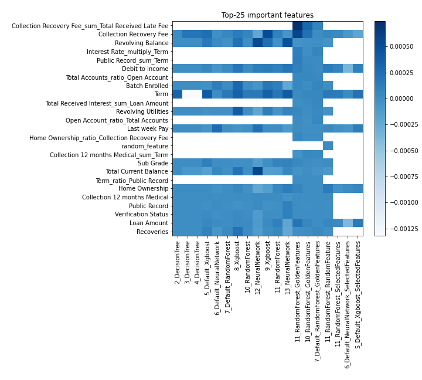
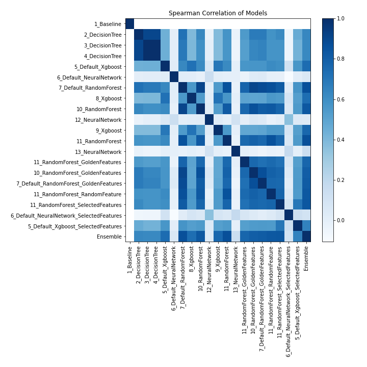

# AutoML Leaderboard

| Best model   | name                                                                                           | model_type     | metric_type   |   metric_value |   train_time |
|:-------------|:-----------------------------------------------------------------------------------------------|:---------------|:--------------|---------------:|-------------:|
|              | [1_Baseline](1_Baseline/README.md)                                                             | Baseline       | logloss       |       0.30827  |         2.26 |
|              | [2_DecisionTree](2_DecisionTree/README.md)                                                     | Decision Tree  | logloss       |       0.30853  |        17.11 |
|              | [3_DecisionTree](3_DecisionTree/README.md)                                                     | Decision Tree  | logloss       |       0.314254 |        18.63 |
|              | [4_DecisionTree](4_DecisionTree/README.md)                                                     | Decision Tree  | logloss       |       0.314254 |        17.55 |
|              | [5_Default_Xgboost](5_Default_Xgboost/README.md)                                               | Xgboost        | logloss       |       0.309061 |        14.8  |
|              | [6_Default_NeuralNetwork](6_Default_NeuralNetwork/README.md)                                   | Neural Network | logloss       |       0.308961 |        20.8  |
|              | [7_Default_RandomForest](7_Default_RandomForest/README.md)                                     | Random Forest  | logloss       |       0.307872 |        54.52 |
|              | [8_Xgboost](8_Xgboost/README.md)                                                               | Xgboost        | logloss       |       0.309361 |        14.93 |
|              | [10_RandomForest](10_RandomForest/README.md)                                                   | Random Forest  | logloss       |       0.307866 |        32.53 |
|              | [12_NeuralNetwork](12_NeuralNetwork/README.md)                                                 | Neural Network | logloss       |       0.318136 |        35.4  |
|              | [9_Xgboost](9_Xgboost/README.md)                                                               | Xgboost        | logloss       |       0.309572 |        28.87 |
|              | [11_RandomForest](11_RandomForest/README.md)                                                   | Random Forest  | logloss       |       0.307865 |        63.35 |
|              | [13_NeuralNetwork](13_NeuralNetwork/README.md)                                                 | Neural Network | logloss       |       0.314488 |        42.35 |
|              | [11_RandomForest_GoldenFeatures](11_RandomForest_GoldenFeatures/README.md)                     | Random Forest  | logloss       |       0.30808  |        50.12 |
|              | [10_RandomForest_GoldenFeatures](10_RandomForest_GoldenFeatures/README.md)                     | Random Forest  | logloss       |       0.307916 |        38.65 |
|              | [7_Default_RandomForest_GoldenFeatures](7_Default_RandomForest_GoldenFeatures/README.md)       | Random Forest  | logloss       |       0.30791  |        43.9  |
|              | [11_RandomForest_RandomFeature](11_RandomForest_RandomFeature/README.md)                       | Random Forest  | logloss       |       0.307976 |        56.52 |
|              | [11_RandomForest_SelectedFeatures](11_RandomForest_SelectedFeatures/README.md)                 | Random Forest  | logloss       |       0.307963 |        42.96 |
|              | [6_Default_NeuralNetwork_SelectedFeatures](6_Default_NeuralNetwork_SelectedFeatures/README.md) | Neural Network | logloss       |       0.312654 |        33.35 |
|              | [5_Default_Xgboost_SelectedFeatures](5_Default_Xgboost_SelectedFeatures/README.md)             | Xgboost        | logloss       |       0.309074 |        20.23 |
| **the best** | [Ensemble](Ensemble/README.md)                                                                 | Ensemble       | logloss       |       0.307693 |         9.16 |

### AutoML Performance

### AutoML Performance Boxplot

### Features Importance

### Spearman Correlation of Models

